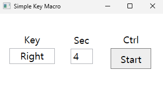

# Simple Key Macro

## How to Use

1. Launch the program
2. Click the button below the **Key**
3. Press the key you want to use
4. Set the interval time (in seconds)
5. Click the **Start** button

## Additional Features

1. You can adjust the interval time using the **Up, Down arrow** (in 0.5 sec)
2. You can Toggle the macro by pressing the **Right Ctrl**